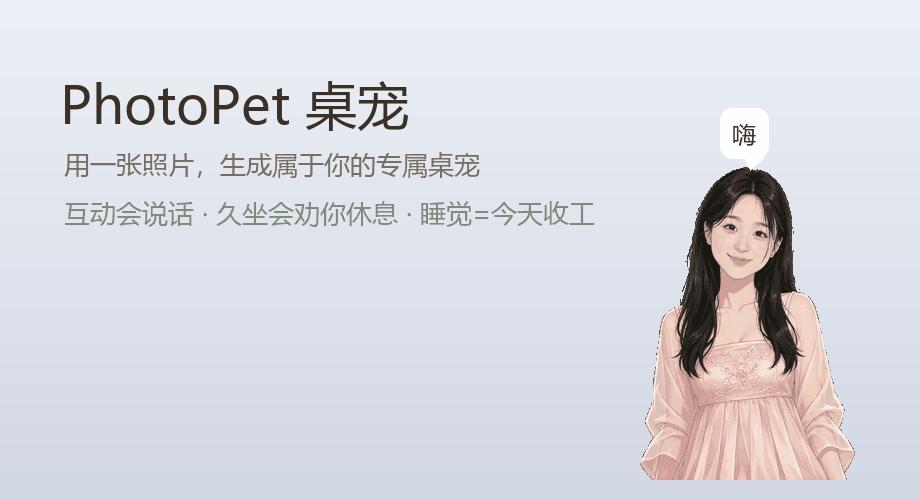

<div align="center">

# 🐾 PhotoPet

**用一张照片，生成属于你的专属桌宠**

上传你自己的照片、你家毛孩子的照片、或者任何你喜欢的角色——
自动生成一只会漂浮、会说话、会撒娇的桌面宠物，常驻你的屏幕角落。



> 上图由真实素材合成（`python scripts/make_demo_gif.py`），不是录屏。
> 想看真实效果，clone 下来跑一次最快 —— 见下面的「30 秒试玩」。

[](LICENSE)
[](https://www.python.org/)
[](#)

</div>

---

## 🏗️ 技术速览（给工程师）

**10,959 行 Python · 20 个运行时模块 · 7 个测试套件 250+ 用例 · 37 个版本迭代 · 运行时只依赖 PyQt6**

业务层（日程/待办/农历/记忆/工具调用…）**全部不依赖 Qt**，所以最容易出错的日期计算和
匹配算法都能脱离界面单测。几个真正解决过的问题：**自研农历表 + 73,019 天逐日验证**
（顺带规避了一个 GPL 库的许可传染）、**给 LLM 的联网工具加 SSRF 防护**（模型给的地址
不可信，挡内网和云元数据地址）、**流式对话按句切分朗读**（首字延迟从 2 秒降到一句）、
**逆向国内 CMS 的 base64+zlib 混淆**、**PyQt6 自绘纸张质感**（横线要对齐文字基线）。

细节和取舍写在 **[docs/ENGINEERING.md](docs/ENGINEERING.md)** ——
包括"为什么不上向量库""为什么不给模型开文件读写""为什么宣讲会宁多报不漏"。

## ✨ 特性

- 🖼️ **一张照片即可生成**：基于 `rembg` 自动抠图，零 PS 基础要求
- 🫧 **原生桌面体验**：无边框透明悬浮窗，置顶显示，不遮挡任何操作
- 🎞️ **GIF 动画**：资源包放一个 `animation/` 文件夹，状态自动切换到对应 GIF
- 📏 **大小档位**：托盘菜单「大小」按 60% ~ 180% 固定缩放，选中即生效并记忆
- 📌 **系统托盘**：常驻托盘，随时显示/隐藏/退出，关掉窗口不退出
- 🔁 **开机自启动**：右键菜单一键开关（Windows）
- 🐾 **多桌宠共存**：一条命令同时启动多只
- 🍖 **养成系统**：饱食度/心情随时间衰减，投喂、抚摸攒好感升级（参考开源项目 [DyberPet](https://github.com/GitHub-Trending/dy/DyberPet) 的养成模型）
- 💾 **存档持久化**：养成数值保存在资源包内，关闭后不丢失
- 🍅 **番茄钟**：专注 25 分钟宠物陪你，完成有庆祝和好感奖励（功能需求来自真实用户调研）
- 🪑 **工作陪伴**：宠物醒着就在记"今天陪了你多久"；**点睡觉 = 今天收工**，它会告诉你陪了你多长时间
- 📇 **人物档案**：给宠物填上姓名、称号、生日、相识日、相恋日，右键「档案」就看到
  **陪伴第 N 天**、生日还有几天、在一起多久 —— 呈现成**一页横线信纸**（暖纸色 + 横线 +
  红边线 + 楷体，横线对齐到字行）。相识日不填就用第一次打开它那天
  （纪念日与倒计时的字段设计参考开源项目 [pet-reminder](https://github.com/kaiCATs/pet-reminder)）
- 🌙 **农历生日**：家里有人过农历生日？填 `"birthday_calendar": "lunar"`，它会自己
  查出"农历十月十九"今年落在公历哪天（每年都不一样：2025-12-08 / 2026-11-27 /
  2027-11-16），并告诉你还有几天、该在哪天订蛋糕
- 📅 **日程**：右键「📅 日程」看下一个安排、「➕ 添加日程…」加一条（也支持每天/每周/每月/每年
  重复）。**提前 N 分钟开口提醒**而不是到点才叫，提醒语会带上还剩多久；关机期间错过的安排
  开机汇总成一条说一次，不逐个重放。日程存在 `schedule.json` 里，可读可手改
- 🛠️ **它会做事**：聊天里说「明天下午三点提醒我开会」，它自己换算日期并记进日程；问
  「我接下来有什么安排」它会查了再答；说「喂你吃东西」它真的去吃。目前开放**日程**
  和**宠物自己的动作**两类工具 —— **不做文件读写、不执行命令**（桌宠不需要这些能力，
  不开就没有对应的风险）
- 🧠 **它记得你**：说「记住：我对花生过敏」，下次新开对话它还记得。记忆存在
  `MEMORY.md`（纯文本，随时可看可删），**密码、银行卡、身份证这类信息会被拦下来不记**
- 🎯 **按简历挑宣讲会**：把 PDF/Word 简历丢给它（右键「📄 导入我的简历…」），
  聊天里问「哪些宣讲会适合我」，它读完近期宣讲会的详情页，按对口程度排序并说明理由，
  说不准的会直说。**只推荐、绝不删** —— 宁可多跑一趟，也不因为判断失误错过一场
- ☔ **下雨提醒**：填上你在哪个城市，快下雨时会提醒你收衣服（`大概 2 小时后可能有雨，
  阳台上的东西收一下？`）。**不做每日天气播报** —— 下雨要收衣服是"事"，"今天晴"不是。
  同一场雨只说一次，重启也不重喊。数据来自 Open-Meteo，**免费且不需要填 key**
- 🎓 **秋招模式**：右键「🎓 抓宣讲会」，它去就业网把最近的宣讲会捞回来（公司 / 时间 /
  地点 / 线上线下），预览确认后进日程，**提前 30 分钟**提醒（要提前到场占座）。
  可开**定时自动同步**，新发现的直接进日程。**不做筛选** —— 只过滤"日期在将来"，
  宁可多报也不漏，漏掉一场宣讲会补不回来
- 📐 **同时段的安排并排显示**：同一时间两场宣讲会会并成一条并提示"同时 3 场，得挑一个去"，
  提醒也说成一句话（`有 3 场撞在一起了：…`），而不是排成两行让人误以为都能去
- 🍽️ **拖文件就是喂它**：把任何文件拖到宠物身上，会看到一张小纸片飞进它嘴里、缩小消失，
  然后它开心地吃掉。（这也是即时反馈 —— 拖进去立刻就"有反应"，不用等解析完）
- 📥 **导入日程文件**：把 Excel / Word / CSV **直接拖到宠物身上**，它读出里面的安排
  变成日程提醒。规整的表格**按规则解析**（不花钱、离线、毫秒级），自然语言（"下周三
  下午三点开会"）交给大模型。**先弹清单让你过目，确认了才写**；已有的条目会标出来
  且默认不勾（同一个文件导两次不会变两份）
- 📋 **待办**：说「我要准备下周的答辩，得整理大纲、做 PPT、还得演练一遍」，它记成一条
  **待办**并拆出子步骤；之后说「大纲整理完了」它会打勾、推进状态。**逾期或今天到期时
  它会主动提醒一次**（同一条一天只说一次）——这是它唯一会主动开口的第三种时机：
  互动、久坐提醒、**有事要办**。定时闲聊和早晚简报依然不做
- ⏰ **劝休息**：连续用电脑满 45 分钟（中途离开会自动重新计时）就弹一个**不抢键盘焦点**的小窗，
  由你决定「好，一起睡」还是「再干一会儿」；劝到第 3 次就会说"我都陪你工作这么久了，放下手里的活吧"
- 🗣️ **说话时嘴动**：放一个 `animation/talk.gif`，说话期间自动切换（没有这个文件就不启用）
- 🤫 **安静陪伴**：默认不做定时闲聊，只在你互动、久坐提醒、收工时开口（可配置）
- 🎮 **全屏自动隐藏**：打游戏/演示时自动躲起来，退出自动恢复
- 💬 **AI 对话**：右键「和它聊天」打开**对话窗口**，填 API key 就能聊（窗口里点「⚙ 设置」填，
  还能一键测连接）。回复**边生成边显示**，而且宠物是**想出一句说一句**的 ——
  第一句一出来就开口，不用等整段生成完。兼容 DeepSeek/OpenAI 等任何 OpenAI 兼容接口
- 🔊 **语音**：默认用神经语音（晓伊/晓晓/云希…12 种音色含东北话、陕西话、粤语可选），断网自动回退系统语音；同一句台词走本地缓存，第二次说是零延迟
- 👻 **鼠标穿透**：开启后点击直接穿透到下层窗口，宠物只看不挡路（关闭入口在托盘菜单）
- 💾 **位置记忆**：重启后宠物回到上次的位置和大小
- 🎭 **AI 驱动动作**：AI 回复会自动触发对应的表情动作，聊天更有生命感
- 🖱️ **丰富互动**：拖拽移动、点击有反应、双击触发打字机气泡对话
- 😴 **多状态动作**：idle 待机（呼吸浮动）/ click 点击反应 / eat 投喂 / sleep 入睡+睡着循环
- 🎵 **状态音效**：`sounds/` 按状态放音频，切状态自动播放；**能从你生成的动画视频里自动抽取音轨**
  （`python scripts/extract_audio.py --pet pets/mypet`，不需要另外找音效）
- 😴 **两段式睡觉**：点睡觉 → 打哈欠声 + 入睡动画 → 自动接睡着后的循环动画 + 呼吸声
- 💬 **台词系统**：台词可在 `pet.json` 的 `dialogues` 里自定义，互动时随机说
- 🎭 **可扩展 Q 版化**：预留 [photo2cartoon](https://github.com/minivision-ailab/photo2cartoon) 接入，一键把照片变成保留五官的 Q 版卡通形象
- 📦 **标准化资源包**：任何人都能制作、分享自己的桌宠资源包

## ⚡ 30 秒试玩（不想装 Python 就看这里）

- **Windows、只想用**：到 [Releases](../../releases) 页下载
  `PhotoPet-windows-x64.zip`，解压后双击 `PhotoPet.exe` 即可 —— 不需要装 Python
- **想自己折腾**：clone 下来装个依赖就能跑，仓库里自带一只示例桌宠（`demo-pet/`），
  首次启动会自动装到 `pets/demo/`，不用先做素材

> 上面那个压缩包由 GitHub Actions 自动构建（`.github/workflows/build.yml`）。
> 打一个 `v*` 标签（如 `git tag v1.0 && git push --tags`）就会自动出包并发布到 Releases；
> 也可以在 Actions 页面手动点 "Run workflow" 触发。

```bash
git clone https://github.com/kk833/PhotoPet.git
cd PhotoPet
pip install -r requirements.txt
python runtime/main.py          # 不带参数 = 加载 pets/ 下全部宠物
```

## 🚀 从头做一个属于你的

### 图形向导（推荐，不用碰命令行）

```bash
git clone https://github.com/kk833/PhotoPet.git
cd PhotoPet
pip install -r requirements.txt
python wizard.py          # 也可以用托盘菜单「✨ 制作新桌宠…」
```

五个步骤，每步都有预览：**选照片 → 起名字/选模型 → 生成形象（看得到结果，不满意可换模型重来）
→ 加动作素材（视频拖进去就变成动画，顺便抽出音效）→ 完成（改台词/人设、导出 .pet、直接启动）**。

做好之后**桌宠会自己冒出来** —— 程序会盯着 `pets/` 目录，出现新的资源包就自动加进来，
不用重启。

> ⚠️ 向导需要**源码方式**运行：抠图依赖 rembg（含模型）差不多 1GB，打进发布版会让体积
> 从 140MB 涨到 1GB+。所以发布版只管「用」，想「做」就用源码方式跑。

### 或者用命令行

### 安装依赖

```bash
git clone https://github.com/kk833/PhotoPet.git
cd PhotoPet
pip install -r requirements.txt
```

### 国内用户加速（可选但推荐）

首次抠图需要下载模型。默认模型 `bria-rmbg` 约 1GB，直连 GitHub 很慢。
运行加速脚本，自动走国内镜像下载到 rembg 缓存目录（只需一次）：

```bash
python scripts/download_model.py                # 高质量模型 bria-rmbg (默认, ~1GB)
python scripts/download_model.py --model u2net  # 轻量模型 (~170MB, 低配电脑)
```

### 生成你的桌宠

```bash
# 把照片放进项目根目录，然后：
python generator/photo_to_pet.py --photo photo.jpg --name mypet

# 低配电脑可选用轻量模型：
python generator/photo_to_pet.py --photo photo.jpg --name mypet --model u2net
```

### 启用 AI 对话 / 语音（可选）

```bash
pip install openai edge-tts   # AI 对话 / 语音，想用哪个装哪个
```

编辑项目根目录自动生成的 `ai_config.json`：

```json
{
  "api_key": "sk-你的key",
  "base_url": "https://api.deepseek.com/v1",
  "model": "deepseek-chat",
  "tts_enabled": false,
  "tts_engine": "auto",
  "tts_voice": "zh-CN-XiaoyiNeural",
  "tts_rate": 0
}
```

| 字段 | 说明 |
|---|---|
| `api_key` | DeepSeek / OpenAI 等兼容接口的 key，留空则隐藏 AI 聊天入口 |
| `tts_engine` | `auto`（默认，优先神经语音，失败回退系统语音）/ `edge` / `sapi` |
| `tts_voice` | 音色，见下表；`sapi` 时留空用系统默认 |
| `tts_rate` | 语速偏移百分比，如 `10` = 快 10% |
| `chatter_seconds` | 定时闲聊间隔秒数，**默认 `0` = 关**（想让它时不时冒句话就设 `15`） |
| `random_action_minutes` | 随机小动作（只做表情、不出声）间隔分钟，`0` = 关 |
| `hungry_nag_minutes` | 饿了自己乞食的最小间隔分钟，`0` = 不主动乞食 |
| `rest_reminder_enabled` | 是否开启久坐提醒 |
| `rest_reminder_minutes` | 连续用电脑满多少分钟提醒一次（默认 45） |
| `rest_reminder_idle_seconds` | 离开电脑超过多少秒就重新计时（默认 60，即"人在不在"的判定阈值） |

**挑声音**：`python scripts/tts_preview.py --list` 看全部音色，
`python scripts/tts_preview.py --voice Xiaoyi` 直接试听（也可 `--all` 挨个听），
选好把音色全名填进 `tts_voice` 即可，不用改代码。

| 音色 | 特点 |
|---|---|
| `zh-CN-XiaoyiNeural` | 晓伊 · 女 · 活泼俏皮（默认，最像桌宠） |
| `zh-CN-XiaoxiaoNeural` | 晓晓 · 女 · 温暖大气 |
| `zh-CN-YunxiNeural` | 云希 · 男 · 阳光少年 |
| `zh-CN-YunxiaNeural` | 云夏 · 男 · 软萌可爱 |
| `zh-CN-liaoning-XiaobeiNeural` | 辽宁小北 · 女 · 东北话 |
| `zh-CN-shaanxi-XiaoniNeural` | 陕西小妮 · 女 · 陕西话 |
| `zh-HK-*` / `zh-TW-*` | 粤语 / 台湾腔 |

重启后右键宠物 → "💬 和它聊天 (AI)"。语音在右键菜单"🔊 语音开关"手动开启，
菜单里会显示当前用的声音。神经语音的合成结果缓存在 `~/.photopet/tts_cache/`，
同一句话第二次说是读本地文件，断网也能说。

想自定义宠物性格？在 `pets/你的宠物/pet.json` 加一个 `"persona": "角色设定"` 字段。

### 启动！

```bash
python runtime/main.py --pet pets/mypet

# 也可以不带参数：自动加载 pets/ 下的全部桌宠
python runtime/main.py
```

桌面上就会出现你的专属宠物 🎉

- **右键宠物**：投喂 / 番茄钟 / 语音开关 / 鼠标穿透 / 睡觉 / 退出
- **右键托盘图标**：显示隐藏、大小档位、鼠标穿透、退出
  （开启穿透后宠物点不到了，关掉请走托盘菜单）

## 📦 打包成 exe（给不想装 Python 的人用）

```bash
pip install "pyinstaller>=6.11"     # 打包工具，只在构建时用
python scripts/make_icon.py         # 先生成图标（也可以换成自己的图，见下）
python build.py --clean             # 打包，产物在 dist/PhotoPet/
python build.py --install           # 装到项目根目录 + 创建桌面快捷方式
python build.py --release           # 组装成可发布的 zip（含示例包与使用说明）
python build.py --with-pets         # 顺便把 pets/ 也复制进产物（分享用）
python build.py --onefile           # 打成单个 exe（启动会慢几秒）
```

**让 GitHub 自动出包**：仓库里已经有 workflow。打标签就自动发布：

```bash
git tag v1.0.0 && git push --tags     # 自动构建并在 Releases 生成可下载的包
```

也可以在仓库的 **Actions** 页面点 "Run workflow" 手动触发（勾上 `create_release` 才会发布，
否则只上传为构建产物，适合发布前先验一遍）。

跑完 `--install` 之后，**桌面上会多一个 PhotoPet 图标，双击即启动，不用再碰命令行**。
也可以右键它固定到任务栏／开始菜单。

### 换成你自己的图标

```bash
python scripts/make_icon.py --image pets/mypet/avatar/idle.png   # 用宠物形象做图标
python scripts/make_icon.py --bg "#7cc4ff" --bg2 "#3d8bff"       # 换个配色
python scripts/make_icon.py                                       # 恢复默认爪印
```

会同时生成 `runtime/icon.png`（托盘用）和 `runtime/icon.ico`（exe 与快捷方式用，内含 16~256 多档尺寸）。
改完重新 `python build.py --install` 生效。

产物是一个 **`dist/PhotoPet/` 文件夹**：`PhotoPet.exe` + `_internal/` + 你的 `pets/`。
整个文件夹压成 zip 就能发给别人，对方解压后双击 `PhotoPet.exe` 即可 —— 不需要装 Python。

几个刻意的取舍：

- **默认 onedir 而不是 onefile**：桌宠是常驻 + 开机自启的，onefile 每次启动都要把
  约 140MB 解压到临时目录，开机要慢几秒、杀软每次都要扫一遍。onedir 启动快得多
- **只打包运行时**：生成器用的 `rembg`/`onnxruntime`/`numpy`/`scipy` 全部排除，
  否则体积会从 140MB 涨到 1GB+（想生成资源包还是用源码跑 `generator/`）
- **配置与存档的位置**：优先放在 exe 旁边（绿色版，解压即用，存档跟着资源包走）；
  万一装到了 `Program Files` 这种只读位置，会自动回落到 `%APPDATA%/PhotoPet/`，
  并把自带的资源包复制过去 —— 不会像以前那样静默丢存档
- **单实例**：同一时间只跑一个（开机自启 + 手动双击不会起两批）。
  想多开用 `PhotoPet.exe --allow-multiple`
- **`--install` 装到项目根目录而不是 `%LOCALAPPDATA%`**：这样 exe 和源码模式
  共用同一份 `pets/` 与存档 —— 双击图标启动和 `python` 启动是**同一只宠物**，
  好感度/陪伴时长不会分裂成两份

> 分享给别人的 zip 里**不含** `ai_config.json`（你的 API key 只存在本地）。

## 🔄 分享你的桌宠（.pet 资源包）

做好的桌宠可以直接打包成一个 `.pet` 文件发给别人（本质上就是个 zip）：

- **导出**：右键托盘图标 → 「📤 导出桌宠…」（多只宠物时会列出让你选）
- **导入**：右键托盘图标 → 「📦 导入桌宠 (.pet)…」，或者**直接把 `.pet` 拖到 `PhotoPet.exe` 上**
- **双击安装**：托盘菜单里打开「🔗 双击 .pet 直接安装」后，别人发来的 `.pet`
  双击就能装进来（只写 HKCU，不需要管理员，随时可以取消）

命令行也能用：

```bash
python runtime/pet_pack.py export pets/mypet 小陪.pet   # 导出
python runtime/pet_pack.py import 小陪.pet              # 导入
python runtime/pet_pack.py check pets/mypet             # 检查资源包是否合规
```

> **养成存档不会跟着走**：`status.json`（好感度）和 `work.json`（陪伴时长）在导出时一律剔除 ——
> 分享形象不等于把养成记录送人。导入是**当作不可信压缩包**处理的：
> 有 zip slip 防护（拒绝 `..`、绝对路径、符号链接）、只接受白名单目录、限制体积。

## 🏗️ 架构

```
照片 ──▶ generator/ 生成器 ──▶ pets/<名字>/ 资源包 ──▶ runtime/ 运行时 ──▶ 桌面
       (抠图+三态派生)        (pet.json + avatar/)     (PyQt6 渲染)
```

```
PhotoPet/
├── runtime/            # 桌宠运行时 (PyQt6)
│   └── main.py         #   悬浮窗 / 动画 / 互动 / 气泡
├── generator/          # 照片 → 资源包
│   ├── photo_to_pet.py #   主流程
│   └── cartoonize.py   #   可选: photo2cartoon 接入
├── pets/               # 生成的资源包（不上传，含个人照片）
├── requirements.txt
├── LICENSE
└── CONTRIBUTING.md
```

## 📦 资源包规范

想分享你自己设计的桌宠？按这个结构组织文件即可，全部都是可选的——
**文件名就是状态名**，放哪个就有哪个，缺的自动回退到 `avatar/idle.png`：

```
mypet/
├── pet.json         # 名称、尺寸、台词、人设（见下表）
├── avatar/          # 静态形象（至少要有 idle.png）
│   ├── idle.png     #   待机
│   ├── click.png    #   点击反应
│   ├── eat.png      #   投喂
│   └── sleep.png    #   睡觉
├── animation/       # 动态优先：同名 GIF 会盖过 avatar/ 的静态图
│   ├── idle.gif     #   待机循环（自带浮动效果）
│   ├── click.gif    #   点击/抚摸
│   ├── eat.gif      #   吃东西
│   ├── sleep.gif    #   入睡过渡（播一遍）
│   └── sleep_loop.gif  # 睡着后的循环段（接在 sleep.gif 之后）
└── sounds/          # 语音包/音效，切到该状态时播放
    ├── click.mp3    #   支持 mp3 / wav / ogg
    ├── eat.mp3
    └── sleep.mp3
```

`pet.json` 字段：

| 字段 | 说明 |
|---|---|
| `name` | 显示名，用于托盘菜单 |
| `size` | 窗口初始尺寸 `[宽, 高]` |
| `base_height` | 人物显示高度基准，所有状态按它等比缩放（保证换状态不忽大忽小） |
| `dialogues` | 自定义闲聊台词池；留空则用内置情绪台词（饿了/心情差时仍用内置的功能性提示） |
| `persona` | AI 对话的人设 system prompt |
| `ai_action_map` | AI 回复命中关键词时触发的动作，如 `{"开心\|哈哈": "click", "睡觉\|晚安": "sleep"}` |
| `profile` | 人物档案：`name` 显示名 / `title` 称号 / `birthday` 生日 / `birthday_calendar` 生日按哪个历过 / `meet_date` 相识日 / `love_date` 相恋日 / `intro` 一句话介绍。日期写 `YYYY-MM-DD`，只写 `MM-DD` 也能算倒计时（但算不出"第几天"）。右键宠物 →「📇 档案」查看 |
| `profile.birthday_calendar` | 省略或 `"solar"` = 公历生日；`"lunar"` = 农历生日。填 `lunar` 时若 `birthday` 带年份（如 `"2001-12-03"`）会被当作**公历出生日**、自动推出农历月日（"只知道公历生日但按农历过"就用这种）；只写月日（如 `"10-19"`）则直接当作**农历月日**（只记得农历生日时用这种，代价是算不出年龄）。数据范围 1900~2099 |

把文件夹发给别人，对方放进 `pets/` 就能直接使用——**不需要懂任何代码**。
素材怎么用豆包/即梦生成，见 [素材制作指南.md](素材制作指南.md)。

## 🗺️ Roadmap

- [x] 人物档案：姓名/称号/生日/相识日/相恋日 + 纪念日倒计时（v0.11）
- [x] 日程助手：记日程、提前提醒、错过补报（v0.12）；自然语言记日程（v0.14）
- [x] 待办（任务层）：子步骤、进度、逾期主动开口（v0.16）
- [ ] token 用量统计与预算（多步任务的成本控制）
- [ ] 工具调用行为日志 + 危险操作撤销（现在删日程是不可逆的）
- [ ] 日历同步（Google/Outlook 的私密 ICS 地址）
- [ ] 生日与纪念日到点提醒（提前几天可配，默认安静）
- [ ] 养成数值周期搬进设置界面（不用再手改 `ai_config.json`）
- [ ] photo2cartoon 一键安装脚本（把照片变成保留五官的 Q 版形象）
- [ ] 多表情 AI 批量生成（一次产出全套动作）
- [ ] 桌宠资源包分享站 / 一键导入
- [ ] 全局热键（穿透模式的键盘开关、快捷键投喂）
- [ ] macOS / Linux 的托盘与图标适配打磨

## 🤝 参与贡献

欢迎任何形式的贡献！请先阅读 [CONTRIBUTING.md](CONTRIBUTING.md)。

⚠️ **隐私提醒**：`pets/`、`素材库/`、你的照片以及含 API key 的 `ai_config.json`
都已被 `.gitignore` 排除。提交前请再确认一次 `git status`，不要把自己的肖像或密钥推上公开仓库。

## 📄 许可证

本项目基于 [MIT License](LICENSE) 开源。

形象生成能力参考了开源项目 [photo2cartoon](https://github.com/minivision-ailab/photo2cartoon)（MIT），在此致谢。

---

<div align="center">

如果这个项目对你有帮助，欢迎点一个 ⭐ Star 支持一下！

</div>
